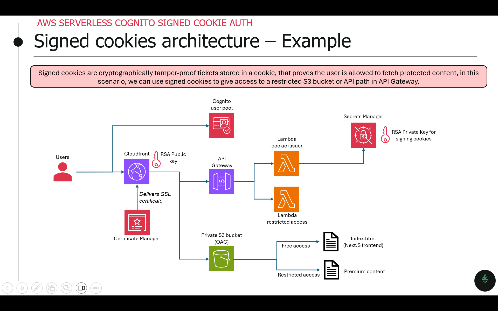

# aws-serverless-cognito-signed-cookie-auth
This project is an example of a serverless signed cookie example using Cognito for authentication.

# High level architecture

# Pre-requisites
In order for this project to be reused, you will first need to create a hosted zone in AWS and have your own root domain name configured with the hosted zone.

# Variables to define before launching
All variables in the file [infra/env/prod.tfvars.example](infra/env/prod.tfvars.example) need to be defined before you can deploy the infrastructure.

# How to use
Launch by doing the following steps :
1. Create the infrastructure `AWS_PROFILE=aws_profile make bootstrap`
2. Deploy the static website on S3 `AWS_PROFILE=aws_profile make release`

# How to terminate
1. Destroy by simply doing `AWS_PROFILE=aws_profile CONFIRM=YES make destroy`
2. Remove all built steps by doing `make clean`

